# Vehicles Detection

### 專案路徑布局

```
├── Advanced_Lane_Lines.py
├── project_video.mp4				# Project 影像
├── challenge_video.mp4				# 挑戰 1) 影像
├── harder_challenge_video.mp4		# 挑戰 2) 影像
├── __init__.py	
├── LICENSE
├── image_processing				# 所有pipline中使用到的function都在此資料夾底下
│   ├── camera_cal					# Project 4 校正相機使用的影像
│   │   └── .....					
│   ├── calibration.py				# Project 4 校正相機function
│   ├── wide_dist_pickle.p			# Project 4 存放校正參數cameraMatrix & distCoeffs
│   ├── edge_detection.py			# Project 4 檢測邊緣,ex:sobel,color transforms
│   ├── find_lines.py				# Project 4 找出車到線function
│   ├── transform.py				# Project 4 轉換測試程式,用來調整測試參數用
│   ├── line_fit_fix.py				# Project 4 檢測找車道function是否有正確找出車道
│   ├── preprocessing.py			# Project 4 影像遮罩，將不重要地方遮罩掉
│   ├── features_extract.py			# Project 5 特徵擷取,ex:HOG, color hist, bin spatial
│   ├── vehicles_detect_model.py	# Project 5 主要function,ex:slide window, draw_boxes
│   └── __init__.py	
├── examples						# 執行結果範例
│   └── .....
├── test_images						# 測試影片
│   └── .....
├── output_images					# 測試影片輸出資料夾
│   └── .....
├── output_video					# 測試影像輸出資料夾
│   ├── project_video_long_line.avi		# 使用較長的道路檢測
│   └── project_video_short_line.avi	# 使用較短的道路建測
└── README.md
```

------

### 1. HOG Features extract

1. **Color space**

   這部份我嘗試了許多種色彩空間，如：RGB, HSV, LUV, HLS, YUV, YCrCb 其中[HSV, HLS], [YUV, YCrCb]色彩空間很像，所以只需要考慮到RGB, HLS, LUV, YUV四個色彩空間。

   ​

   首先我使用了以下這張圖片來測試各個色彩空間的結果。

   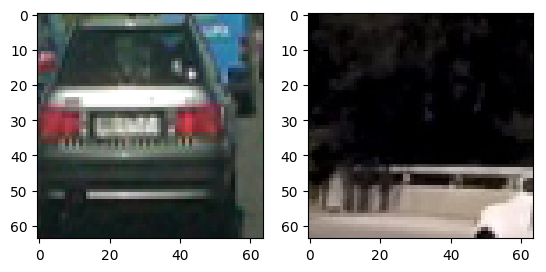

   結果如下面所示，而經過測試後決定採用HLS H, L channel , LUV U channel：

   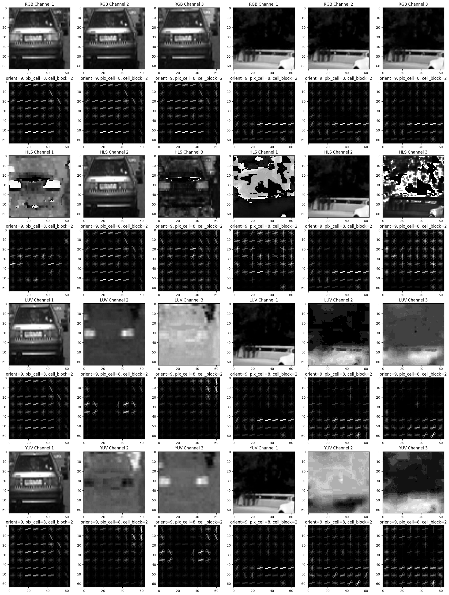

   ​

   接下來我們使用下面四張圖片來測試，其中左邊數來第三張紅色汽車會比第一章汽車還要難判斷。

   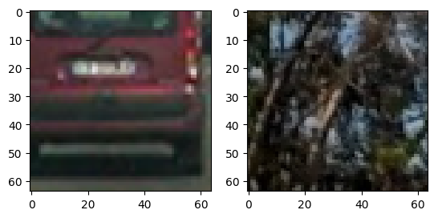

   - HLS: H channel 用來偵測車燈

     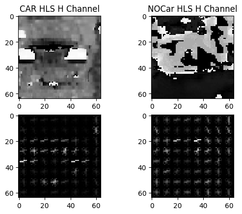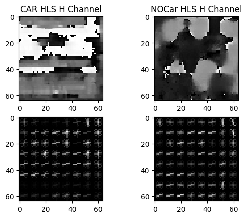   

   - HLS: L channel 用來偵測汽車外型

     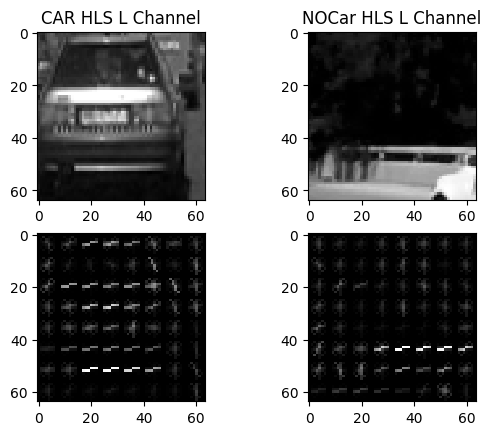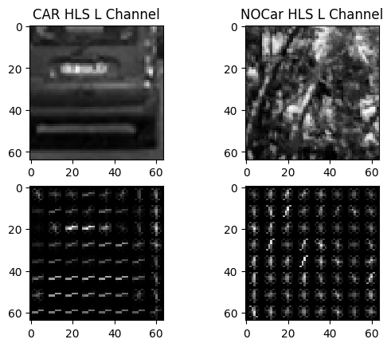 

   - LUV: U channel 用來偵測車燈

     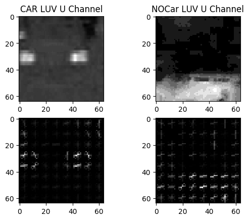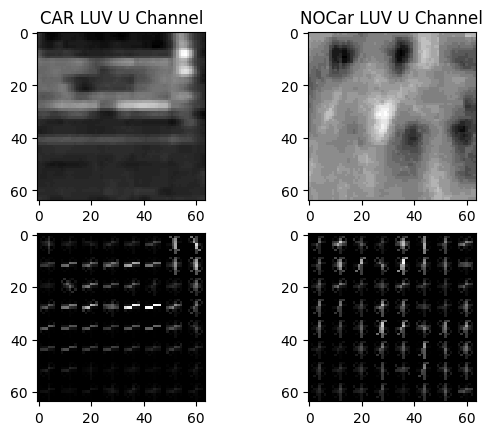 


2. **HOG orientations**

   這個參數可以影響每個格子中的方向有幾種。例如：orient = 9 就會將360°分為9個方向。透過修改這個參數可以細部車輛的外型。

   - orient = 7

   - orient = 9

   - orient = 11

     

3. **HOG pixels per cell**

   這個參數影響一張照片會被劃分為幾的方格。例如訓練的影像都是64x64的，而pexels per cell = 8時，整張圖片會被化分為8x8方格，如果pexels per cell = 6的話就會被劃分為10x10方格。

   - pixels per cell = 6

   - pixels per cell = 8

   - pixels per cell = 10

     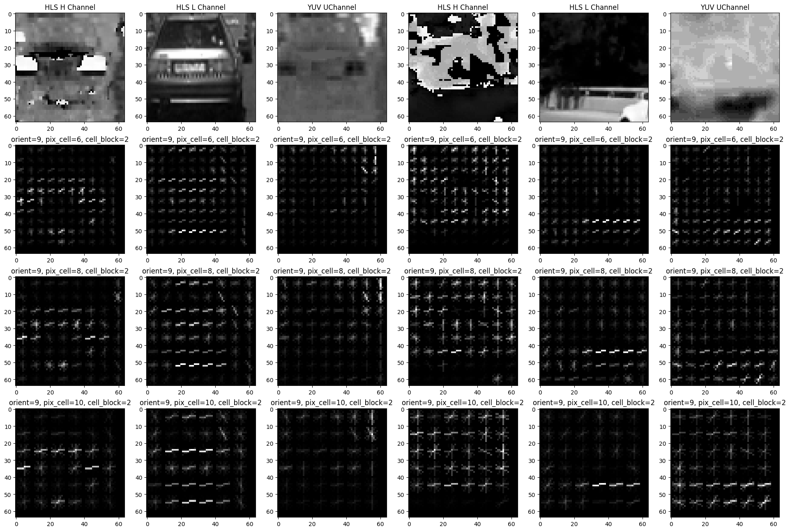

#### HOG Summary

```python
orient = 9
pixels per cell = 8
hog_features = []
hog_features.append(get_hog_features(image_hls[:, :, 0],
                                     orient, pix_per_cell, cell_per_block,
                                     vis=False, feature_vec=True))
hog_features.append(get_hog_features(image_hls[:, :, 1],
                                     orient, pix_per_cell, cell_per_block,
                                     vis=False, feature_vec=True))
hog_features.append(get_hog_features(image_luv[:, :, 1],
                                     orient, pix_per_cell, cell_per_block,
                                     vis=False, feature_vec=True))
```


---

### 2. Sliding Window Search

為了確保遠近的車輛都可以偵測到，這裡我使用了四種大小的window，程式片段如下。

```python
windows1 = slide_window(image, x_start_stop=[None, None], y_start_stop=y_start_stop,
                        xy_window=(64, 64), xy_overlap=(0.5, 0.5))

windows2 = slide_window(image, x_start_stop=[None, None], y_start_stop=y_start_stop,
                        xy_window=(96, 96), xy_overlap=(0.5, 0.5))

windows3 = slide_window(image, x_start_stop=[None, None], y_start_stop=y_start_stop,
                        xy_window=(128, 128), xy_overlap=(0.7, 0.7))

windows4 = slide_window(image, x_start_stop=[None, None], y_start_stop=y_start_stop,
                        xy_window=(200, 200), xy_overlap=(0.75, 0.75))
```

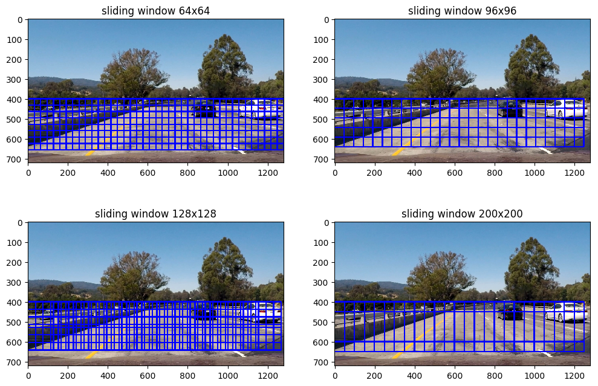


---

### 3. Training SVM

在training svm 的時後除了HOG features還可以調整兩個參數，分別為`bin_spatial` 和  `color_hist` ，這兩種參數能做更動的地方就是`color_space`，在原本的預設使用`color_space='RGB'` 訓練出來的 Accurac與`color_space='HLS'` 差異不大，但在輸出影效觀察到後者會比較好。

**左 color_space='RGB', 右color_space='HLS'**

​     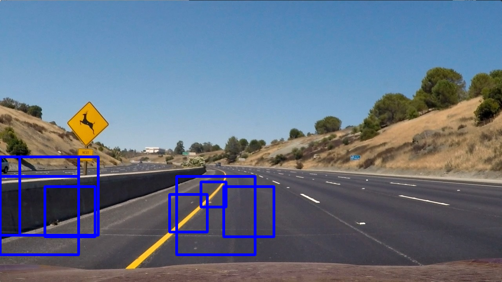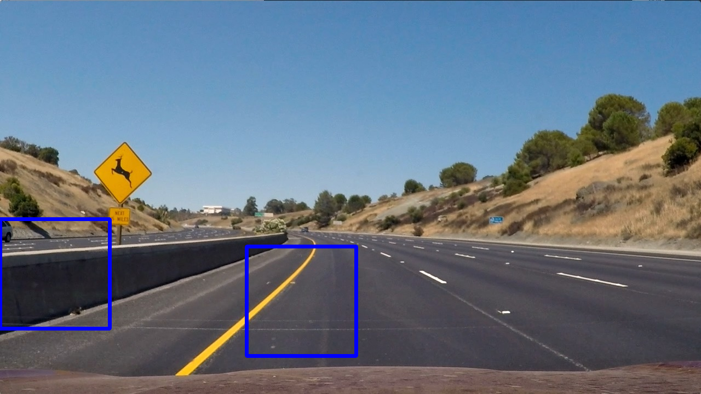   


#### SVM Training Summary
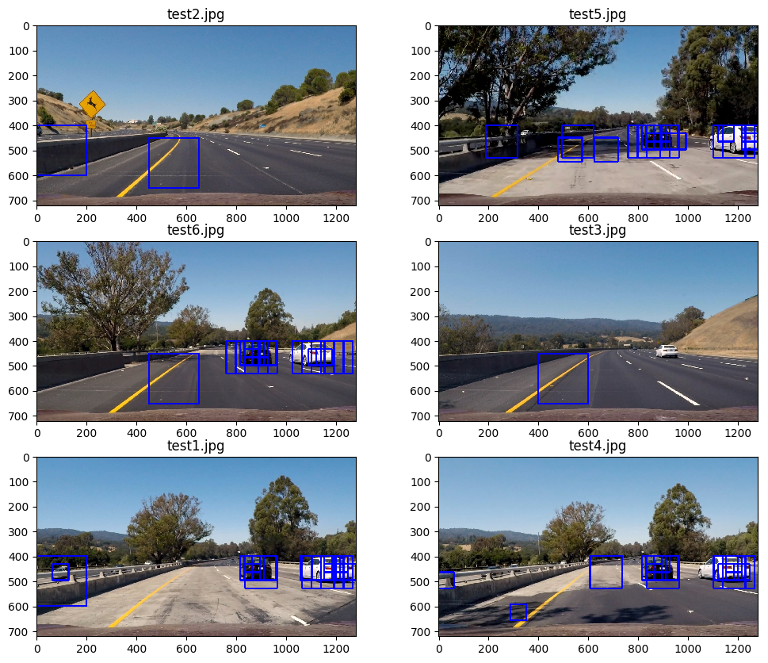

---

### 4. Heat Maps

```python
def add_heat(heatmap, bbox_list):
    # Iterate through list of bboxes
    for box in bbox_list:
        # Add += 1 for all pixels inside each bbox
        # Assuming each "box" takes the form ((x1, y1), (x2, y2))
        heatmap[box[0][1]:box[1][1], box[0][0]:box[1][0]] += 1

    # Return updated heatmap
    return heatmap

def apply_threshold(heatmap, threshold):
    # Zero out pixels below the threshold
    heatmap[heatmap <= threshold] = 0
    # Return thresholded map
    return heatmap

heatmap = np.zeros_like(img[:, :, 0]).astype(np.float)
heatmap = add_heat(heatmap, hot_windows)
heatmap = apply_threshold(heatmap, 2)
```

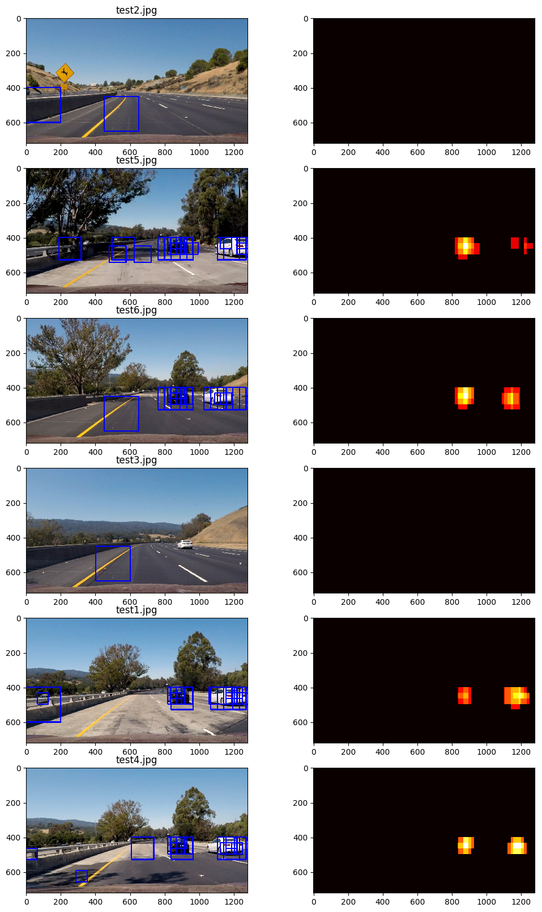


---

###5. Labels bboxes

這裡我們始用scupy image processing包，將上求到的熱點圖分類，結果如下圖所示。

```python
from scipy.ndimage.measurements import label

def draw_labeled_bboxes(img, labels):
    # Iterate through all detected cars
    for car_number in range(1, labels[1]+1):
        # Find pixels with each car_number label value
        nonzero = (labels[0] == car_number).nonzero()
        # Identify x and y values of those pixels
        nonzeroy = np.array(nonzero[0])
        nonzerox = np.array(nonzero[1])
        # Define a bounding box based on min/max x and y
        bbox = ((np.min(nonzerox), np.min(nonzeroy)), (np.max(nonzerox), np.max(nonzeroy)))
        # Draw the box on the image
        cv2.rectangle(img, bbox[0], bbox[1], (0, 0, 255), 6)
    # Return the image
    return img

labels = label(heatmap)
img_out = draw_labeled_bboxes(img, labels)
```

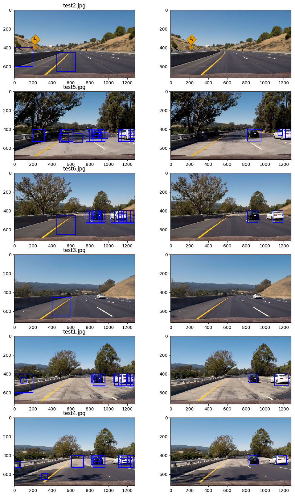


---

### 6. Improve Heat map and labels bboxes

上面所顯示的結果會發現bounding box因為threshold的關係改變，如果threshold設定太大bboxes會變得非常小，所以我在這多加一個判斷改進它。

```python
def detection_v2(img, hot_windows, save=False):
    # 1) heat map
    heatmap = np.zeros_like(img[:, :, 0]).astype(np.float)
    heatmap = add_heat(heatmap, hot_windows)
    # 2) threshold 2
    heatmap_threshold = np.copy(heatmap)
    heatmap_threshold = apply_threshold(heatmap_threshold, threshold=2)
    # 3) scipy label
    labels = label(heatmap_threshold)
    # 4) label bboxes
    bboxes = label_bboxes(labels)
    # 5) mask
    mask = apply_mask(heatmap, bboxes)
    # 5) threshold 1
    heatmap = combine_mask_threshold(heatmap, mask=mask, threshold=1)
    # 6) scipy label
    labels = label(heatmap)
    # 7) draw labeles bboxes
    img_out = draw_labeled_bboxes(img, labels)
    return img_out
```


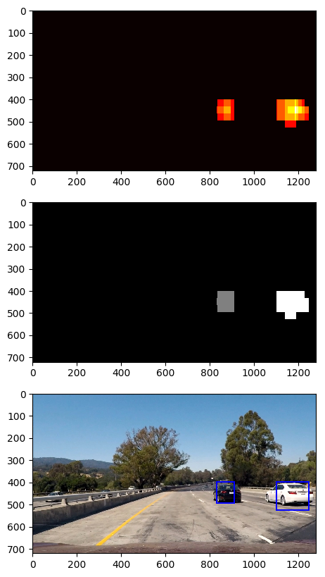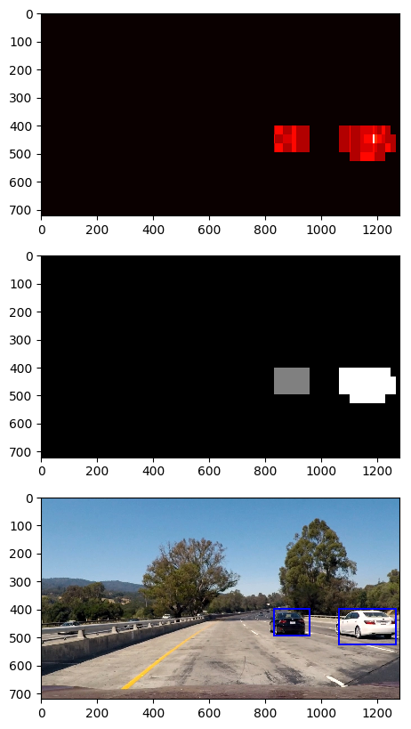 


#### Vehicles detection Improve Summary

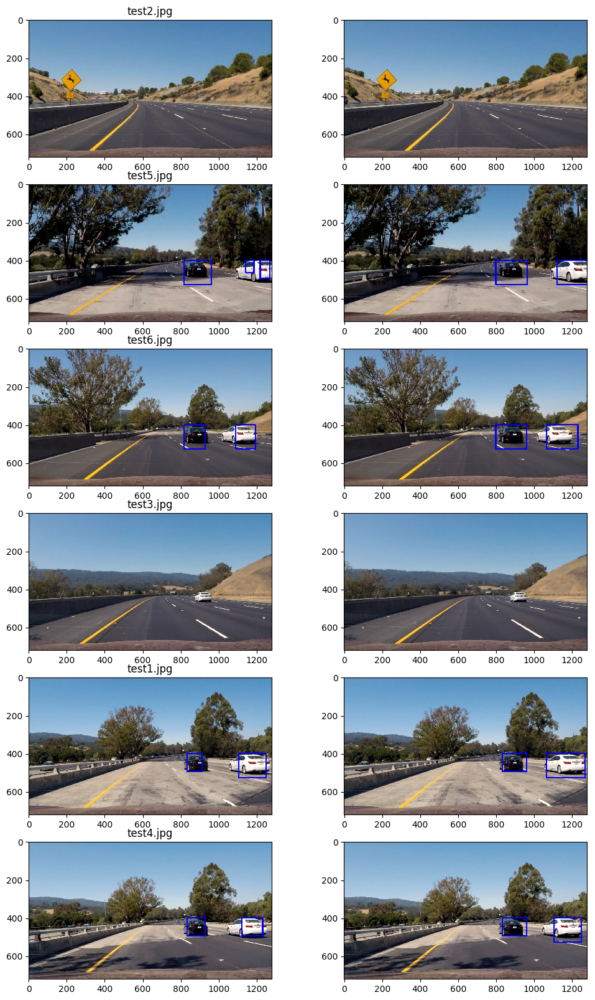


---

## Combine Lane Finding and Vehicles Detection

更改參數

```python

```

